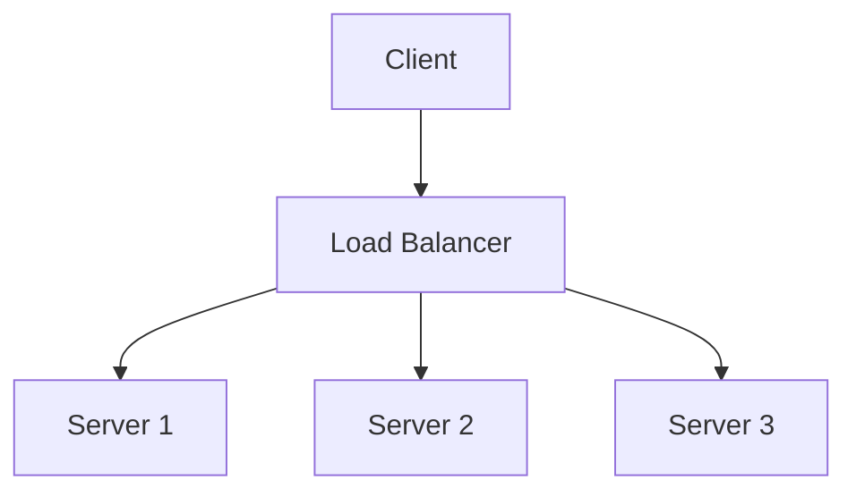
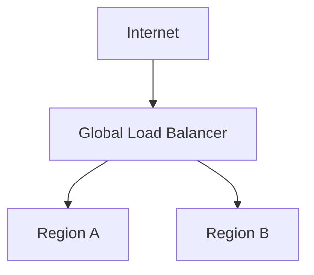
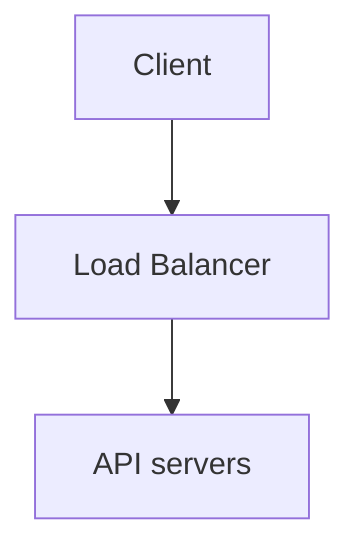
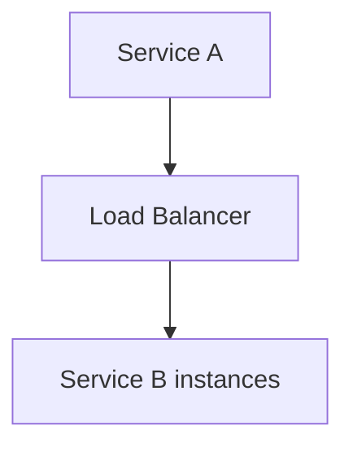
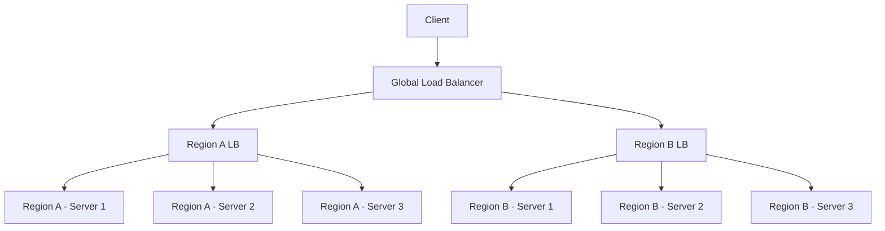

# Load Balancers – Introduction

A **Load Balancer (LB)** distributes incoming traffic across multiple servers. This helps systems handle more requests, improves availability, and prevents individual instances from being overloaded.

In this article, we’ll briefly walk through the most important aspects to consider when designing load balancers. Detailed articles are comming!

## How it works

## Load Balancer Use Cases

### 1. Global Load Balancing

Traffic is distributed across regions. Key concepts include:

- DNS-based Global LB
- Anycast

Many modern solutions use these principles.

### 2. Application-Level Load Balancing

**Examples:** Nginx, HAProxy in HTTP mode, AWS ALB

### 3. Internal Services

**Examples:** Route 53, Cloudflare DNS

---

## OSI Layers for Load Balancing

Load balancers can operate at different layers of the OSI model:

- **Network Layer (L3)**
- **Transport Layer (L4)**
- **Application Layer (L7)**

---

## Load Balancing Algorithms

### 1️⃣ Round Robin

- **How it works:** Requests are distributed sequentially across backends in a loop.
- **Pros:** Simple, evenly distributes load for similar instances.
- **Cons:** Does not account for server load or capacity.
- **Use case:** Suitable for small systems with similar machines.

### 2️⃣ Weighted Round Robin (WRR)

- **How it works:** Each backend gets a weight → higher weight = more requests.
- **Pros:** Can balance servers with different capacities.
- **Cons:** Still does not consider current load.

### 3️⃣ Least Connections / Connection-Based

- **How it works:** Requests go to the server with the fewest active connections.
- **Pros:** Good for long sessions or uneven request sizes.
- **Cons:** Requires tracking active connections.

### 4️⃣ Random

- **How it works:** Requests are randomly sent to a backend.
- **Pros:** Simple, works in large backend pools.
- **Cons:** May cause uneven load distribution in short intervals.

### 5️⃣ Hash-Based / Consistent Hashing

- **How it works:** Requests are routed based on a hash (e.g., client IP, session ID).
- **Pros:**
  - Sticky sessions without LB storing state
  - Stable when backend count changes (used in cache/CDN)
- **Cons:** Uneven hash distribution can cause hotspots.
- **Example Use:** Apache Cassandra

### 6️⃣ Least Response Time / Weighted Least Response Time

- **How it works:** Requests go to the backend with the lowest average response time (optionally weighted).
- **Pros:** Dynamically adapts to backend load.
- **Cons:** Requires backend performance monitoring.

---

## Handling Requests Across Multiple Servers

In distributed systems, user requests are often routed through a load balancer to multiple backend servers. This creates
a challenge when applications rely on local session state—for example, shopping carts in e-commerce systems. If a user’s
request is routed to a different server, their session data may be lost.

To solve this, several strategies are commonly used:

### Sticky Session

The LB generates/maps a session ID to a specific backend.

### Stateless Backend + Token / JWT

Session is carried in a token → any LB can handle the request.

### Shared Session Store

All backends access a common session store (e.g., Redis, Memcached).

### Consistent Hashing

Instead of mapping every session, the LB redirects requests based on a computed hash → less state in the LB.

---

## Health Checks

Load balancers monitor the health of backend servers and route traffic away from unhealthy ones. If multiple load
balancer instances are used, they should also monitor each other.

---

## Scaling Load Balancers

### Horizontal Scaling

Adding new backend instances horizontally.

- **Active-Passive:** One LB is active, others are on standby.
- **Active-Active:** All LBs actively distribute traffic.

### Global Scaling

In geo-distributed systems, a global LB (using Anycast/DNS) directs traffic to different regions. Each region can scale its local LB horizontally.

### Summary

As you can see, there are many things to think about. We’ll go through each of them in the upcoming articles.

Thanks for reading!
